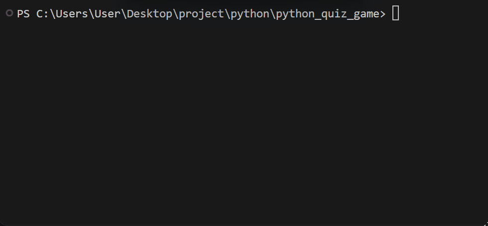

# Python Quiz Game

A simple quiz game built with Python.


## Table of Contents

* [Features](#features)
* [Project Structure](#project-structure)
* [File Description](#file-description)
* [Requirements](#requirements)
* [Installation](#installation)
* [Environment Setup](#environment-setup)
* [Usage](#usage)
* [Example](#example)
* [Screenshots](#screenshots)
* [Demo](#demo)
* [Roadmap](#roadmap)
* [Contributing](#contributing)
* [License](#license)
* [Author](#author)

---

## Features

* **Quiz System**

  * Asks the player multiple questions
  * Checks the answers automatically
  * Calculates the final score

* **Results Storage**

  * Saves quiz results in `result.txt`

* **Admin Mode**

  * Asks for an admin password
  * Checks if the password is correct
  * Keeps private information outside the main Python file
  * Loads the password from `.env`

---

## Project Structure

```text
python_quiz_game/
│
├── .env.example
├── .gitignore
├── main.py
├── question.py
├── requirements.txt
├── README.md
├── result.txt
│
├── gifs/
│   └── demo.gif
│
└── pictures/
    ├── pic1.png
    ├── pic2.png
    └── pic3.png
```

### File Description

| File                | Description                                             |
| ------------------- | ------------------------------------------------------- |
| `main.py`           | Main file used to run the quiz game                     |
| `question.py`       | Stores questions and answers                            |
| `requirements.txt`  | Lists the Python packages needed for the project        |
| `.env.example`      | Shows the environment variables needed by the project   |
| `.gitignore`        | Tells Git which files and folders should not be tracked |
| `README.md`         | Contains the project documentation                      |
| `result.txt`        | Stores the quiz results                                 |
| `pictures/`         | Stores project screenshots                              |
| `pictures/pic1.png` | Screenshot of the game start                            |
| `pictures/pic2.png` | Screenshot of the quiz screen                           |
| `pictures/pic3.png` | Screenshot of the final result                          |
| `gifs/`             | Stores demo GIF files                                   |
| `gifs/demo.gif`     | Shows the project demo                                  |

---

## Requirements

Before running the project, make sure you have:

* Python 3.12
* `python-dotenv`

---

## Installation

1. Open a terminal in the project folder.

2. Check that Python is installed:

```bash
python --version
```

3. Install the required packages:

```bash
pip install -r requirements.txt
```

---

## Environment Setup

1. Create a `.env` file from `.env.example`.

### Windows PowerShell

```powershell
Copy-Item .env.example .env
```

### Linux / macOS

```bash
cp .env.example .env
```

2. Open the new `.env` file.

3. Replace the example value with your own password:

```text
QUIZ_ADMIN_PASSWORD=your_password_here
```

4. Save the file.

> Do not commit your `.env` file because it may contain private information.

---

## Usage

1. Open a terminal in the project folder.

2. Run the quiz game:

```bash
python main.py
```

3. Choose `yes` or `no` for Admin Mode.

4. If you chose `yes`, enter the password from your `.env` file.

5. Enter your name.

6. Answer the questions.

7. See your final score and message.

8. Your result is saved in `result.txt`.

---

## Example

```text
Do you want to open Admin Mode? yes/no: no

What's your name? Alex

Welcome!

What language are we using? C++

Wrong!

What command starts a Git repository? git init

Correct!

What command shows Git status? git status

Correct!

Your score is: 2 out of 3

Keep practicing, Alex!
```

---

## Screenshots

### Start Game


### Quiz


### Final Score


---

## Demo



---

## Roadmap

* [x] Add multiple quiz questions
* [x] Calculate the final score
* [x] Save results to a file
* [x] Add Admin Mode
* [ ] Add more quiz questions
* [ ] Add difficulty levels
* [ ] Add a timer

---

## Contributing

Contributions and suggestions are welcome.

If you find a bug or have an idea for improving the project, feel free to create an issue or submit a pull request.

---

## License

This project is created for learning and educational purposes.

---

## Author

Created by [Amirhossein Sourghali](https://github.com/a-h-ourghali)
